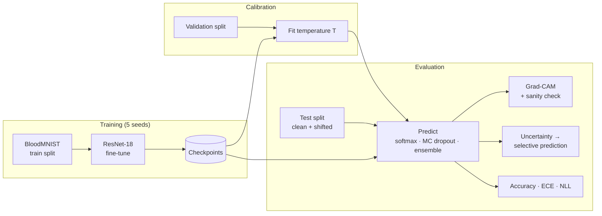

# Trustworthy Medical Image Classification

> A blood-cell classifier that reports how sure it is, hands its least certain cases to a human, and shows where in the image it looked.


**Status:** 🚧 In active development. Every figure in this README comes from a committed run in `results/`. Until a run exists, the value reads _pending_.

🔗 **Live demo:** coming soon

<!-- Record the Gradio demo, save to assets/demo.gif, then uncomment.

-->

---

## Overview

**Problem.** A standard image classifier gives its wrong answers with the same high confidence as its right ones. At 96% accuracy, one cell in twenty-five is misclassified, and the softmax score does not say which one. In a hematology lab, where a blood-cell differential count decides what happens next for a patient, a model that cannot tell when it is unsure cannot safely take over any of the work.

**Approach.** A ResNet-18, pretrained on ImageNet and fine-tuned on BloodMNIST (eight classes of peripheral blood cell), with three layers of trust added on top:

1. **Calibration.** Does 90% confidence mean right 90% of the time? Measured with expected calibration error (ECE) and reliability diagrams. Corrected with temperature scaling, fitted on the validation split only.
2. **Uncertainty.** MC dropout on the classification head and a five-model deep ensemble, compared against the plain softmax. The uncertainty score drives **selective prediction**: the model keeps the cases it is sure about and refers the rest to an expert.
3. **Explanation.** Grad-CAM heatmaps of the image regions behind each prediction, plus a sanity check that the heatmaps depend on the trained weights and are not just edge detection.

All three are then re-measured on a **shifted test set**, with simulated staining, focus and noise changes, because a second microscope in a second lab is the realistic way these models fail.

**Why it matters.** A clinician does not ask how accurate a model is on average. They ask whether they can trust this particular answer. The headline result here is a risk–coverage curve, which shows how accurate the model is on the cases it chooses to keep, and how many it has to hand back to get there.

## Results

Evaluated on the official BloodMNIST test split (3,421 images). **Pending.** Filled from `results/` as each step lands.

| Metric | Value | Notes |
|--------|-------|-------|
| Accuracy | _pending_ | Single ResNet-18 |
| Macro-F1 | _pending_ | Weights all eight classes equally, so rare classes count |
| ECE (before → after temperature scaling) | _pending_ | 15 equal-width bins; lower is better |
| Accuracy at 90% coverage | _pending_ | Most uncertain 10% referred to an expert |
| AURC | _pending_ | Area under the risk–coverage curve; lower is better |

### Uncertainty methods compared

| Method | Accuracy | ECE | NLL | AURC | Extra cost |
|--------|----------|-----|-----|------|------------|
| Softmax (baseline) | _pending_ | _pending_ | _pending_ | _pending_ | none |
| + Temperature scaling | _pending_ | _pending_ | _pending_ | _pending_ | one parameter |
| MC dropout (30 passes, head only) | _pending_ | _pending_ | _pending_ | _pending_ | last layer run 30× |
| Deep ensemble (5 models) | _pending_ | _pending_ | _pending_ | _pending_ | 5× training and inference |

### Under distribution shift (deep ensemble)

| Shift | Severity | Accuracy | ECE | Mean entropy |
|-------|----------|----------|-----|--------------|
| None | – | _pending_ | _pending_ | _pending_ |
| Stain (hue / saturation) | 1 / 3 / 5 | _pending_ | _pending_ | _pending_ |
| Defocus blur | 1 / 3 / 5 | _pending_ | _pending_ | _pending_ |
| Sensor noise | 1 / 3 / 5 | _pending_ | _pending_ | _pending_ |

Accuracy is expected to fall as severity rises. The test is whether uncertainty rises with it, and whether calibration holds.

## Data

[BloodMNIST](https://medmnist.com/), from the MedMNIST v2 benchmark, derived from the peripheral blood cell dataset of [Acevedo et al. (2020)](https://doi.org/10.1016/j.dib.2020.105474).

| | |
|---|---|
| Images | 17,092 microscopy images of single blood cells |
| Classes | basophil, eosinophil, erythroblast, immature granulocyte, lymphocyte, monocyte, neutrophil, platelet |
| Official split | 11,959 train / 1,712 validation / 3,421 test |
| Source | Hospital Clinic of Barcelona, CellaVision DM96 analyser |
| Resolutions | 28, 64, 128 and 224 px (MedMNIST+). The resolution behind each result is stated with it |
| Licence | CC BY 4.0 |

**The images are not committed to this repository.** `data/` is git-ignored, and the `medmnist` package downloads the dataset on first run.

The official splits are used unchanged. The validation split is used for early stopping and for fitting the temperature, and nothing else. The test split is touched once per reported number.

## Tech stack

`Python 3.12` · `PyTorch` · `torchvision` · `MedMNIST` · `scikit-learn` · `NumPy` · `Matplotlib` · `Gradio` · `uv`

## Quickstart

```bash
# 1. Clone
git clone https://github.com/ayindemalik/Trustworthy-Medical-Image-Classification.git
cd Trustworthy-Medical-Image-Classification

# 2. Install (uv handles the virtual environment and the lockfile)
uv sync

# 3. Look at the data: class counts, example cells, simulated shift
uv run trustmed explore --size 224

# 4. Train (repeat with seeds 1-4 for the deep ensemble; a GPU is strongly recommended)
uv run trustmed train --size 224 --seed 0

# 5. Run every model on the clean and shifted test sets, and cache the outputs
uv run trustmed predict --size 224

# 6. Metrics, tables and charts, computed from the cached outputs in seconds
uv run trustmed evaluate --size 224

# 7. Grad-CAM grids and the sanity check
uv run trustmed explain --size 224
```

Add `--size 64 --limit 512` to any command for a quick test on a CPU. Output files from a quick test are named `*_limit512*` and never mix with real results.

The results in this README are produced on a free Colab T4 GPU, running the same commands as `python -m trustmed ...`.

## Project structure

```
Trustworthy-Medical-Image-Classification/
├── src/trustmed/
│   ├── cli.py            # command-line entry point
│   ├── config.py         # every tunable value, in one place
│   ├── data.py           # BloodMNIST loading, augmentation, simulated shift
│   ├── explore.py        # class counts and example pictures
│   ├── model.py          # ResNet-18 with a dropout head; saving, loading, running it
│   ├── train.py          # training loop, early stopping, checkpoints
│   ├── predict.py        # every model on every test condition, cached to outputs/
│   ├── calibration.py    # ECE, NLL, Brier, temperature scaling
│   ├── uncertainty.py    # entropy, risk–coverage, AURC, error-detection AUROC
│   ├── evaluate.py       # metrics, tables and charts from the cached outputs
│   ├── explain.py        # Grad-CAM and the weight-randomisation check
│   └── plots.py          # every chart, one shared style
├── tests/                # pytest: the metrics on cases with known answers
├── scripts/              # CPU vs GPU speed test
├── results/              # metrics JSON and markdown tables (committed)
├── figures/              # reliability diagrams, risk–coverage curves, Grad-CAM grids
├── data/                 # git-ignored; downloaded on first run
├── models/               # git-ignored checkpoints
├── outputs/              # git-ignored cached predictions
├── pyproject.toml
└── README.md
```

## How it works



Three details do most of the work.

- **Temperature scaling changes confidence, never the answer.** It divides every logit by one learned number, T. The ranking of classes is unchanged, so accuracy stays the same and only the confidence moves. T is fitted on the validation split. Fitting it on the test split would make the calibration result circular.
- **Deep ensembles are the strong baseline, MC dropout is the cheap one.** Five independently trained networks tend to disagree exactly where the data is ambiguous, and they have held up best under distribution shift in published comparisons (Ovadia et al., 2019). They cost five times the training. MC dropout costs nothing extra to train, and because the dropout sits only before the last layer, its 30 prediction passes re-run that one layer and nothing else. The comparison table is there to show whether the cheaper method is good enough.
- **A heatmap is only evidence if it depends on the model.** Some saliency methods produce nearly the same map from a randomly initialised network (Adebayo et al., 2018), which means they show image edges, not the model's reasoning. Grad-CAM is re-run after the trained weights are randomised, and the similarity between the two maps is reported. A trustworthy explanation should change.

## Roadmap

- [ ] Publish the results tables, reliability diagrams and risk–coverage curves
- [ ] Gradio demo: upload a cell image, get a prediction, a confidence, a "refer to expert" flag and a Grad-CAM overlay
- [ ] Real shift instead of simulated shift: test on blood-cell images from a different lab and scanner (for example Raabin-WBC, on the five white-cell classes both datasets share)
- [ ] Conformal prediction: prediction sets with a guaranteed coverage level, as an alternative to a single-label answer
- [ ] Published container image, then a hosted demo

## Limitations

- **Only normal cells.** BloodMNIST comes from people without haematological disease, so it contains no leukaemic or otherwise abnormal cells. How the model's uncertainty behaves on an abnormal cell is not measured here, and it is the case that matters most clinically.
- **One hospital, one analyser.** Simulated staining and blur are a stand-in for lab-to-lab variation, not a replacement for it.
- **Low resolution.** The images are downsampled from 360 px. Fine nuclear detail is lost, and Grad-CAM maps are coarse at the resolutions a CPU can train on.
- **Grad-CAM shows where, not why.** A heatmap on the nucleus says the model used the nucleus. It does not say what about the nucleus it used.
- **The ensemble members share a starting point.** All five start from the same ImageNet weights and differ only in the new head, the data order and the augmentation, so they are less diverse than networks trained from scratch.
- **Research code, not a medical device.** It is not validated for clinical use.

## Data citation

If you use this repository, please also cite the datasets it is built on:

- J. Yang, R. Shi, D. Wei, Z. Liu, L. Zhao, B. Ke, H. Pfister, B. Ni. *MedMNIST v2 – A large-scale lightweight benchmark for 2D and 3D biomedical image classification.* Scientific Data, 10, 41 (2023).
- A. Acevedo, A. Merino, S. Alférez, Á. Molina, L. Boldú, J. Rodellar. *A dataset of microscopic peripheral blood cell images for development of automatic recognition systems.* Data in Brief, 30, 105474 (2020).

## License

Released under the [MIT License](LICENSE). The MIT licence covers this source code only. BloodMNIST remains under CC BY 4.0.

## Author

**Dr. Maliki Moustapha** — PhD, Deep Learning & Computer Vision
📧 ayindemalik1@gmail.com · [LinkedIn](https://www.linkedin.com/in/maliki-moustapha-phd-525646169/) · [Portfolio](https://malikimoustapha.binotix.com/) · [Google Scholar](https://scholar.google.com/citations?user=bQe5fD0AAAAJ&hl=en) · [ORCID](https://orcid.org/0000-0001-9306-8554)
